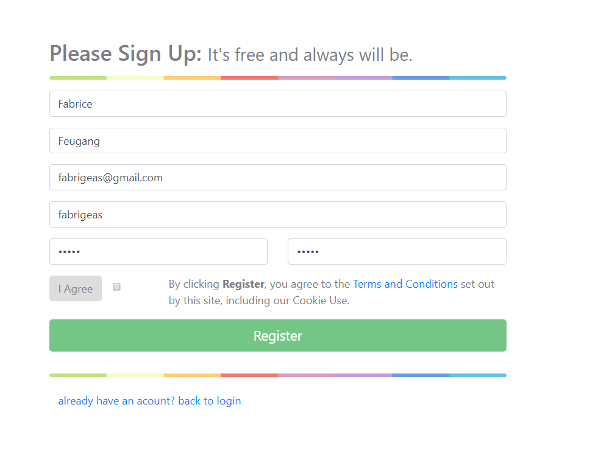
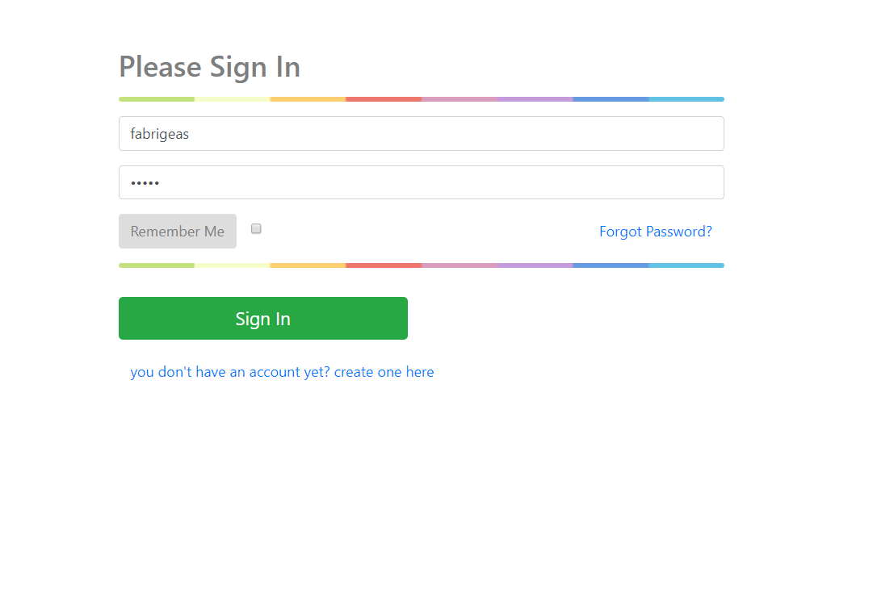
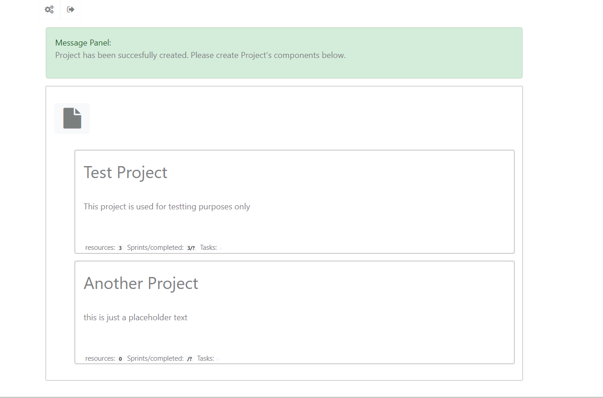
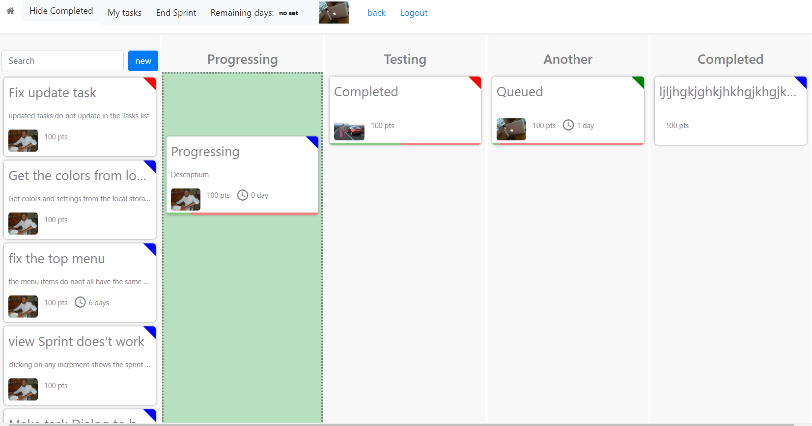
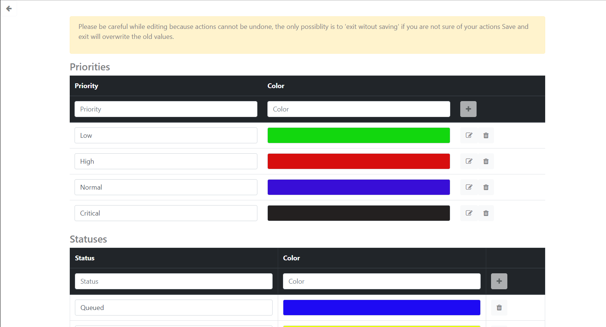

# Scrum Lightware in Angular

## About Scrum

  This project is an application that emulates the scrum agile project management.
  The home page displays a list of projects.
  Click on a project to view it's content.
  A project consists of: 
 
    
1. Project
    
      A project is the basic construct. it consists of 
      1. Increments/sprints: i.e. milestones or steps that lead to project completion 
      2. Resources: (is people/workers that can perform tasks to complete the project).
      3. Tasks: a List
    
2. Resources
     
     These are mostly humans. Each user require a username and password, which are created
     by the Project manager (the person that creates the project).

3. Increments

    An Increments is the most important part of the project. 
    You may decide to complete an increment by starting a sprint for the increment. 
    When starting a sprint, you need to 
      1. set a definition of done (DOD) i.e. the conditions to be met before the sprint can be considered complete
      2. Select a list of Resources that will be required for the sprint, 
          this is optional because most sprints require all resources in the project. 
      3. select or create a list of tasks that are required for the increment/sprint.
     Once you have created the sprint, click on start to begin the sprint.
     
     Once a sprint has been started for an increment, this sprint can be viewed by clicking on the increment.
     In the sprint, you define a list of statuses in which a task can be. Typical statuses include
     - Queued: the default status for a task (all tasks stay in this list)
     - In progress (Progressing): each resource drops a task from the queue in to this list to work on it
     - Completed: this list holds completed tasks, resources drop tasks from the 'In progress' list into this list.
     - Testing: (optional). A task can be transitioned from the 'In progress' list in to this list before completion.

4. Sprints 

     Each Resource/user needs to login to view the project. Each logged in user can access a sprint and and assign a task to himself.
     The project manager can assign tasks to resources.
     
     Once all the tasks have been moved from the 'Queued' list into the 'Completed List', the sprint can be ended i.e. the 
     end button in the sprint view is enabled and can be clicked on.
     
4. Tasks (self explanatory)

 
## Quick Start

  Download or Clone this project in to a secure location on the computer

1. Requirements and installations
    
      The app requires NodeJs and MongoDb.
      To check if they are already installed, 
      open the cmd or bash command line and run the following commands, 
        
    - node --version
    - db.version()
    
    If any of them is not installed, do install:
     
      - [install NodeJs](https://nodejs.org/dist/v10.1.0/node-v10.1.0-win-x64.zip)
      - [install MongoDb](https://www.mongodb.com/dr/fastdl.mongodb.org/win32/mongodb-win32-x86_64-2008plus-ssl-3.6.4-signed.msi/download) 
      
2. Start the Application

    1. start Mongodb
    
            C:\Program Files\MongoDB\Server\3.6\bin\mongod.exe

    2. start the express backend
    
            cd C:\pathToThisProject\ScrumLightwareAngular\backend-express
            nodemon ./bin/www or npm ./bin/www
    
    3. Open the app
      
        [http://localhost:4200/](http://localhost:4200/)

## Screenshots

1. User's registration view

2. Login view

3. Home view

4. Sprint's view

5. Settings view

## Further development (todo)

1. Features

  - implement start/end sprint
  - implement calculations: number of tasks/completed
  - implement edit project details as dialog?
  - [crop user's image and save it to mongodb](https://www.npmjs.com/package/ngx-img-cropper)
  - beautify the app

2. Code

    - implement unit test
    - refactor the code

